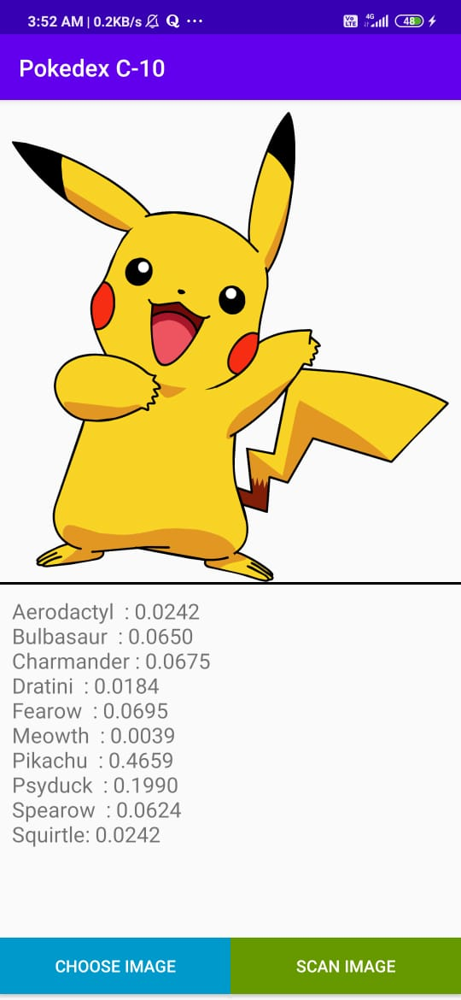
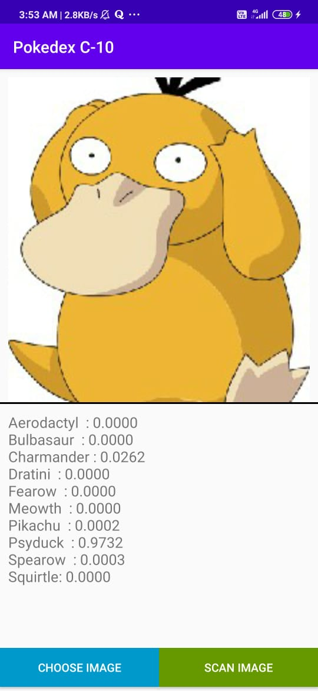
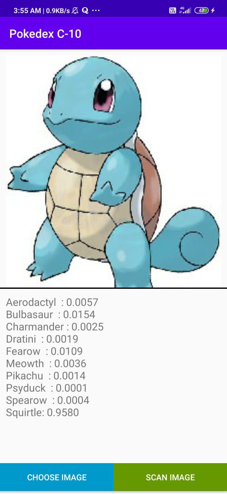

# Pokemon Classification using Mobilenet V2 Firebase

- Used Transfer learning with mobilenet-v2 for classifying 10 different types of pokemon. Implemented it inside android application by using custom firebase mlkit. 

- User can capture or upload image of pokemons and model will give probabilities of each pokemon.

 

## Screenshots of application - 

| 1. Pikachu                                 | 2. Psyduck                                 | 3. Squirtle                                 |
|--------------------------------------------|--------------------------------------------|---------------------------------------------|
| | ||

 

### Pokemon Classes - 
- Aerodactyl  
- Bulbasaur  
- Charmander 
- Dratini  
- Fearow  
- Meowth  
- Pikachu  
- Psyduck  
- Spearow  
- Squirtle
